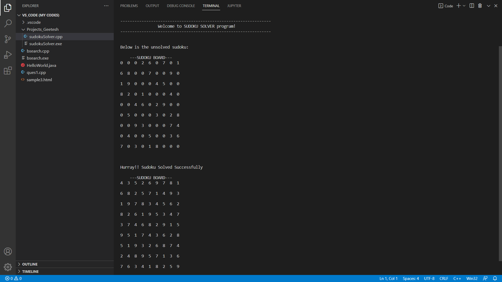

# Sudoku Solver using backtracking.

# [Code](/sudokuSolver.cpp) Walkthrough:

Welcome to the explaination of my project Sudoku Solver using Backtracking.

This project is implemented by me to gain a clear understanding of the topic algorithmic technique [backtracking](https://www.geeksforgeeks.org/backtracking-introduction/). Let's dive into each function of the code and understand what it does.

1) The main function
    - Does the job of displaying the start of program by a welcome message.   
    - Has a pre-defined unsolved sudou as a 2D matrix
    - I have commented part of code which can take real time input for the sudoku problem instead of using the hard coded sudoku, but it kind of becomes hectic for the user to input 81 (9x9 matrix) elements through the keyboard, but still for the sake of including I have it commented.
    - Calls the solver function, if it returns true prints success message.
    - Displays the solution for our sudoku.

2) The displayBoard function
    - Simply displays the sudoku passed as argument to it wherever it is called.
    - Uses a nested for loop to print the 2D matrix

3) The isInsertValid function
    - Checks whether the number passed to this function with a specific row and column is suitable for insertion for valid sudoku.
    - Rule 1: checks if the number is not already present in that particular row.
    - Rule 2: checks if the number is not already present in that particular column.
    - Rule 3: checks if the number is not already present in that particular grid/box.
    - If all rules are passed, the insertion is valid so returns true, else returns false.

4) The validDigits function
    - Returns a vector full of integers from 1 to 9 which are valid for insertion at that (row,col). 
    - Uses isInsertValid function to perform checks on all digits from 1 to 9.

5) The duplicateBoard function
    - For backtracking we need to keep a copy of last correct path so that if the path we are checking currently is not correct we can go back to previous path to continue the check.
    - So this function helps in creating the copy whenever called wherever needed in our code.
 
6) The nextEmpty function 
    - This function returns a pair (row,col) which is empty(i.e unfilled cell of sudoku).
    - Simply traverse through the matrix add row and col to pair where board(row)(col) == 0.

7) The solver function
    - This is the function which does the solving of sudoku, with help of other functions
    - This is a recursive function, with a base case to stop if row>8, which means if we reach at row=9 (keeping in mind 0 indexing) we have done all checking and found our solution for the sudoku.
    - The function then checks the current (row,col) is empty or not, if it is not empty it finds the next empty cell using funtion nextEmpty. And runs the solver recursively for this particular empty (row,col).
    - Now as we have found the empty cell (row,col), we find valid digits that can be placed in this cell using the function validDigits.
    - If there are no valid digits to place here return false. Invalid sudoku.
    - Else traverse through all digits that are placeable here and implement backtracking to check all combination
    - Atlast we will have the solved sudoku.

This is a screenshot after running the code in VS code terminal

